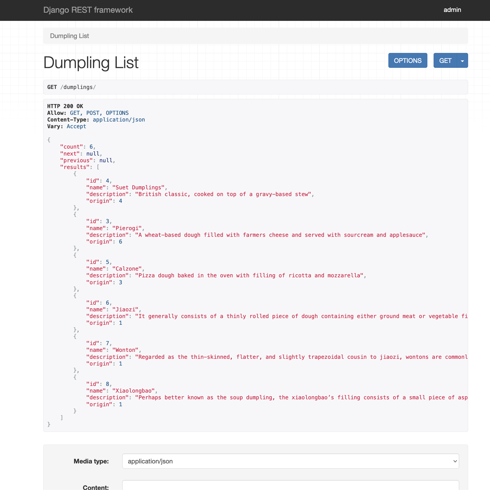

# Dumpling Truck WebApi
_by Kim Robinson_

### A webapi containing dumpling information, categories and tags.

#### Goals:
- To create my first Django WebApi
- Integrate PostgreSQL
- Manage one-to-many and many-to-many relationships
- Build a front end React client to consume this webapi[link to come]
- Manage dotenv
- Set up admin and user accounts and manage user permissions

### A User can:
- Register for an account
- Sign in
- Sign out
- See dumpling data
- Create, edit and delete created dumplings

### SQL Database

### Endpoints
- testing with Postman
Base URL: localhost:8000/

#### Authentication

POST http://127.0.0.1:8000/signup
Content-Type: application/json
Body: { "username": "tester", "password": "[password]" }
Response:
{
  "token": "[secret-token-here]",
  "user": {
    "id": 2,
    "username": "tester",
    "password": "[hashed-password-here]",
    "email": "test@test.com"
  }
}

POST http://127.0.0.1:8000/login
Content-Type: application/json
Body:
{ "username": "tester", "password": "[password]", "email": "test@test.com"
}
Response: 
{
  "token": "[secret-token-here]",
  "user": {
    "id": 2,
    "username": "tester",
    "password": "[hashed-password-here]",
    "email": "test@test.com"
  }
}
/logout ENDPOINT deletes your token and ends your session

---
#### Dumpling Endpoints

GET http://localhost:8000/api/dumplings/
GET http://localhost:8000/api/dumplings/{id}
POST http://localhost:8000/api/dumplings/
PUT http://localhost:8000/api/dumplings/{id}
DELETE http://localhost:8000/api/dumplings/{id}

See all dumplings:
GET http://127.0.0.1:8000/dumplings/
Response:
{
    "dumplings": [
        {
            "id": 1,
            "name": "Ravioli",
            "description": "pillowy soft, filled with ricotta cheese",
            "origin": 3
        },
        {
            "id": 2,
            "name": "Momo",
            "description": "steamed and yummy",
            "origin": 5
        }]
}

Create new dumpling:
POST http://127.0.0.1:8000/dumplings/
Body: {
            "name": "Suet Dumplings",
            "description": "British classic, cooked on top of a gravy-based stew",
            "origin": 4
        }
Response: 201 created

GET dumpling by id:
http://127.0.0.1:8000/dumplings/2
response: {
    "id": 2,
    "name": "Momo",
    "description": "steamed and yummy",
    "origin": 5
}
PUT dumpling by id:
(You can only edit a dumpling you have created, put your token in the header like so)
http://127.0.0.1:8000/dumplings/1
Content-Type: application/json
Authorization: Token [TOKEN-HERE]
body: {
    "name": "Ravioli",
    "description": "pillowy soft, filled with ricotta cheese",
    "origin": 3
}
response: {
    "id": 1,
    "name": "Ravioli",
    "description": "Wheat-based dough that's pillowy soft, filled with ricotta cheese",
    "origin": 3,
    "owner": [YOUR-USERNAME]
}

DELETE dumpling by id:
http://127.0.0.1:8000/dumplings/1
Content-Type: application/json
Authorization: Token [TOKEN-HERE]
Response: 204 No Content

### Stretch Goals
- Add comment/rating section
- Add a find this dumpling feature which can link to a local restaurant serving it and integrate MapBox for a waypoint and/or directions
- User dashboard to save favorite dumplings
- Add a recipe option? To share dumpling recipes. 
- Allow user to have crud for origin and tag? (more endpoints)

### License
See license.md for more information

### Acknowledgements
* Thank you [Caleb Curry](https://www.youtube.com/@codebreakthrough) for the great youtube walkthrough.  It was smooth and gave me a great jumping off point to add in 2 more models and establish a one-to-many and a many-to-many relationship to my webApi. 

* Thanks Adam for the great tutorial walking through [Django Rest Framework Authentication](https://github.com/alamorre/django-rest-auth)